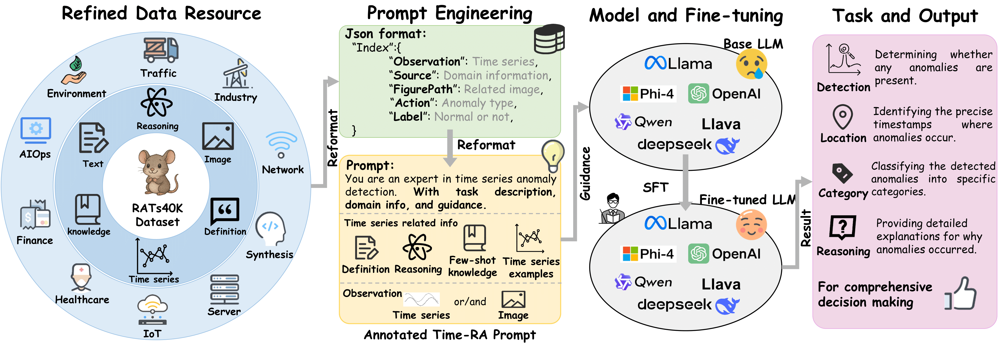

# Time-RA
Time-RA: Towards Time Series Reasoning for Anomaly with LLM Feedback [[ArXiv](https://arxiv.org/abs/2507.15066)]

The **RATs40K** dataset has been open-sourced and is available for download [here](https://huggingface.co/datasets/Time-RA/RATs40K/tree/main).

||
|:--:| 
| *Figure 1. The Time-RA workflow: A novel multimodal reasoning framework for multi-task time series anomaly detection.* |
